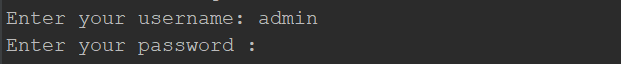
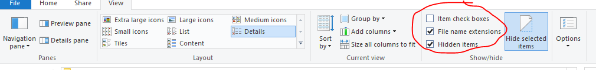

# To Run the program

1. Double click RunWOJournalEntry.bat file.

2. Fill in the AiM login username and password in the command line window, note that the password won't be shown on the screen. Click enter and the program will continue.



# Install the program (for developers)

1. Install [Miniconda (Python)](https://docs.conda.io/en/latest/miniconda.html)  on your local machine, with default settings. You can access conda via the console, to make sure it's properly installed please run `conda -V` to display the version, and run `python -V` to display the version.

2. Create new virtual environment. Open Anaconda Prompt and run (taken an example of python 3.10):

    ```conda create --name selenium_env python==3.10 –y```

3. Once it's created you can activate it by running: ```conda activate selenium_env```

4. Go to (i.e. cd) the current directory, run ```pip install -r requirements.txt``` under the activated virtual environment

5. Set up environment variables for Windows System. Notice it might be slightly different from person to person. Typical PATH is C:\Users\user_ID\AppData\Local\Continuum\miniconda3\envs\selenium_env

6. To show hidden files in Windows OS:



7. Copy paste the .json file into *\backend folder. Otherwise the RPA cannot interact with Google Spreadsheet.

8. Run the run_demo.bat, it will call WO_journal_entry(demo).py, and check if everything works.
9. The current design is to download the latest ***Chrome Webdriver*** automatically when running the program, no need to manually download the webdriver.

# Important Notes for Users

1. If there are any questions or improvement suggestions, feel free to contact IIM team.


# Reference

[Blog: Accessing Google Spreadsheet with Python](https://towardsdatascience.com/accessing-google-spreadsheet-data-using-python-90a5bc214fd2)